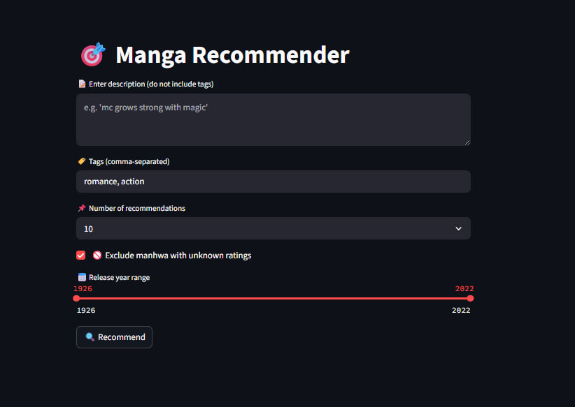

# 🧠 ComicFinder

ComicFinder is an AI-powered content-based recommendation system built using Python and OpenAI Embeddings. 
It helps users discover semantically similar manga, manhwa, manhua, and webtoons based on natural language descriptions, genres, or titles — ideal for fans seeking personalized recommendations beyond keyword search.



---

## 💻 Live Demo Of Comic Finder
**https://comicfinder.streamlit.app/**

---

## 🚀 Features Of Comic Finder

- 🔍 Recommends similar manga/manhwa/manhua/webtoon based on descriptions or titles
- 📦 Utilizes precomputed `clean_embeddings.npy` for fast results
- 🧠 Embedding generation using OPENAI embeddings api
- ⚡ Fast cosine similarity search for real-time recommendation
- 🖥️ Clean Streamlit-based frontend
- 📁 Organized data and scripts for easy retraining or extension

---

## 📁 Project Structure

```
comic-recommender/
├── app.py                       # Main application script
├── data/
│   ├── data.csv                 # Original manhwa dataset
│   ├── clean_data.csv           # Cleaned and preprocessed data
│   └── clean_embeddings.npy     # (Ignored from Git, must be downloaded separately)
├── scripts/
│   ├── clean_dataset.py         # Data cleaning script
│   ├── generate_embeddings.py   # Embedding generation
│   └── recommend.py             # Similarity-based recommendations but CLI version
├── .env                         # Store API keys 
├── requirements.txt             # Python dependencies
└── README.md                    # You're here!
```

---

# 🔧 How to Install and Run ComicFinder Locally
```
git clone https://github.com/AdityaEXP/ComicFinder.git
cd ComicFinder

# Optional: Create virtual environment
python -m venv venv
source venv/bin/activate  # On Windows: venv\Scripts\activate

pip install -r requirements.txt
streamlit run .\app.py
```

---
## 📌 Example Use Cases
- Find romance manhwa similar to *What's Wrong with Secretary Kim?*
- Get fantasy webtoon recommendations with strong male leads
- Discover hidden manga gems with character development arcs
- Replace genre filters with AI-powered natural language queries

---

# 📥 Download Embedding File
Since clean_embeddings.npy is large, it’s not included in this repo.
[📦 Download clean_embeddings.npy](https://drive.google.com/file/d/1toZRablb8yCVhFrICdU1jQtmYh20mZ9P/view?usp=sharing)
Or you can also generate the clean_embeddings.npy using your own openai api key it will cost around $0.02 per generation

---

# 🔐 Environment Variables
Create a .env file for your OpenAI API Key
```
OPENAIKEY=sk-xxxxxx
```

---

# 📜 License
MIT — free to use, modify, and distribute.

---

# 🤝 Author
Aditya
🛠️ AI + Python + Web3 Enthusiast

---

## 📚 Dataset Source and Preprocessing
This project uses data inspired by or adapted from the following Kaggle dataset:

**📊 [Kaggle - Manhwa and Webtoon Dataset](https://www.kaggle.com/datasets/victorsoeiro/manga-manhwa-and-manhua-dataset/data)**  
Credit to **Victor Soeiro** for compiling and sharing this dataset.
