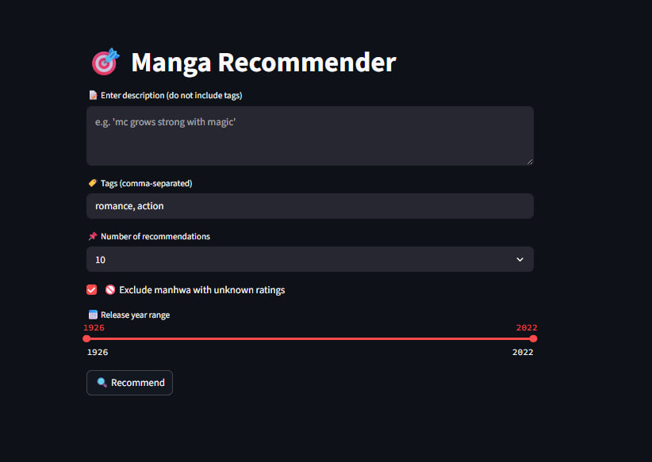

# 🧠 ComicFinder V2

ComicFinder is an AI-powered content-based recommendation system built using Python and OpenAI Embeddings. 
It helps users discover semantically similar manga, manhwa, manhua, and webtoons based on natural language descriptions, genres, or titles — ideal for fans seeking personalized recommendations beyond keyword search.



---

## 💻 Live Demo Of Comic Finder
**https://comicfinderv2.streamlit.app/**

---

## 🚀 Features Of Comic Finder

- 🔍 Recommends similar manga/manhwa/manhua/webtoon based on descriptions or titles
- 📦 Utilizes precomputed `embeddings.npy` for fast results
- 🧠 Embedding generation using OPENAI embeddings api
- ⚡ Fast cosine similarity search for real-time recommendation
- 🖥️ Clean Streamlit-based frontend
- 📁 Organized data and scripts for easy retraining or extension

---

## 📁 Project Structure

```
comic-recommender/
├── app.py                       # Main application script
├── data/
│   ├── core_dataset_with_index.csv   # Cleaned and preprocessed data 
│   └── embeddings.npy                # (Ignored from Git, must be downloaded separately)
├── scripts/
│   ├── generate_embeddings.py   # Embedding generation
│   └── recommend.py             # Similarity-based recommendations but CLI version
├── .env                         # Store API keys 
├── requirements.txt             # Python dependencies
└── README.md                    # You're here!
```

---

# 🔧 How to Install and Run ComicFinder Locally
```
git clone https://github.com/AdityaEXP/ComicFinder.git
cd ComicFinder

# Optional: Create virtual environment
python -m venv venv
source venv/bin/activate  # On Windows: venv\Scripts\activate

pip install -r requirements.txt
streamlit run .\app.py
```

---
## 📌 Example Use Cases
- Find romance manhwa similar to *What's Wrong with Secretary Kim?*
- Get fantasy webtoon recommendations with strong male leads
- Discover hidden manga gems with character development arcs
- Replace genre filters with AI-powered natural language queries

---

# 📥 Download Embedding File
Since clean_embeddings.npy is large, it’s not included in this repo.
It will be auto downloaded by code

---

# 🔐 Environment Variables
Create a .env file for your OpenAI API Key
```
OPENAIKEY=sk-xxxxxx
```

---

# 📜 License
MIT — free to use, modify, and distribute.

---

# 🤝 Author
Aditya
🛠️ AI + Python + Web3 Enthusiast

---

## 🗒 TODOs
1. User should be able to sort manhwa recommendations by ratings.
2. Improve UI, show tags convert html description into normal one
3. Display Manhwa Details Along With Chapters. Ex: completed/ongoing etc
4. Fetch review of manhwa from social sites and also display related manhwas to them.

## 🔮 Future Plans
1. Replace cosine similarity by FAISS for fast searches
2. Adding Anime and webseries dataset as well
3. Create a automated source for scrapping data from webpages or api and update the dataset periodically.
4. Improve searching by creating high value embeddings using more data etc.


